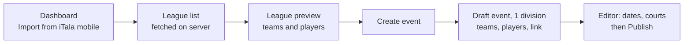

# iTala mobile + iTala Connect integration roadmap

Status: plan, 25/09/2026. Owner: Aeron. Nothing built yet.

**Direction.** iTala Connect is the source of truth for **fixtures** (events, divisions, teams on the schedule, who plays whom, when and where). The iTala mobile app is the source of truth for **stats and final scores** of the games it records. The two are joined at **mobile league = Connect division**, with an explicit team-to-team map. Everything below builds on that one link.

We start small. Both apps are new, and the mobile app has only one or two leagues that are not yet in iTala Connect, so the first slice is a simple "bring a mobile league into iTala Connect" button. Later stages reuse the link it creates.

| Stage | What | Direction of data | When |
| --- | --- | --- | --- |
| **1. League import (first slice)** | Fetch mobile leagues, pick one, create a Connect event from it with its teams and players, already linked | Mobile to Connect, read only | **Build first**, straight after foundations and the design choice |
| 1b. Roster refresh | On a linked division, show mobile teams and players not yet in Connect and add them on request | Mobile to Connect, read only | Soon after stage 1 |
| 2. Results inbox | Pull finished mobile games, match to fixtures, admin approves (the old platform's feature, PRD M-01 to M-09) | Mobile to Connect, read only | With the rest of the admin parity work |
| 3. Schedule sync | Mobile app shows Connect's scheduled games per league with a Start button; optionally pushes finals back | Connect to mobile (and back) | After cutover. Parked plan: [SCHEDULER_INTEGRATION_PLAN.md](SCHEDULER_INTEGRATION_PLAN.md) |

## 1. Stage 1: League import

### 1.1 User flow

1. On the admin dashboard, an admin clicks **Import from iTala mobile**. (The button only exists when the integration is configured.)
2. iTala Connect fetches the mobile app's leagues on the server and lists them.
3. The admin picks a league and sees a preview of its teams and players.
4. The admin clicks **Create event**. iTala Connect creates a **draft** event with one division holding those teams and players, and links the division to the mobile league.
5. The admin lands in the event editor, adds dates, courts and times, adjusts anything, and publishes as normal.

### 1.2 League list

| Column | Source (mobile `leagues`) | Notes |
| --- | --- | --- |
| Name | `name` | |
| Season | `season` | |
| Teams | count of `teams` for the league | |
| Status tags | `is_closed`, `is_archived` | Shown as "Closed", "Archived"; still selectable |
| In iTala Connect | a Connect division already linked to this `league_id` | Shows "Linked to {event name}" with a link to it |

- Hidden by default: recreational drop-in spaces (`kind = 'recreational'`, including shared ones with `is_shared`). A "Show drop-in spaces" toggle reveals them.
- Sorted by name, like the old integration.
- States: loading; "No leagues found in the iTala mobile app."; "Can't reach the iTala mobile app right now. Try again." with a Retry button; integration not configured (button hidden).

### 1.3 Preview and create

- Preview lists each team (name, coach, number of players, "Team only" tag for `team_only` teams) and its players (jersey number, name) in the mobile order (`teams.player_ids`).
- Editable before creating: **Event name** (default: league name) and **Division name** (default: league name). The season is shown for reference.
- If the league is already linked to a Connect division: warning "This league is already linked to {event}. Creating another event will link it twice." with Open existing event (primary) and Create anyway.
- If the league has fewer than 2 teams: allowed, with the note "You'll need at least 2 teams before you can publish."
- **Create event** runs one server action that, in a single Postgres transaction:
  - creates the draft event with the normal new-event defaults (PRD E-01), owned by the signed-in admin;
  - creates one division (first colour of the cycle, bracket count 1);
  - creates teams (name, coach) and players (name, number) in mobile order;
  - writes the division link (`league_id`, `league_name`, `season`, `linked_at`, `linked_by`) and the one-to-one team map (Connect team to mobile team id);
  - stores the mobile player id on each imported player (for future player-level stats);
  - writes an audit row "Imported from iTala mobile league {name}".
- Then redirects to the editor with the toast "Event created from {league}. Add dates and courts, then publish."

### 1.4 Field mapping

| Mobile | iTala Connect | Rule |
| --- | --- | --- |
| `leagues.id` | `division_mobile_links.league_id` | The link. Never matched by name. |
| `leagues.name` | `events.name`, `divisions.name` | Default values, editable |
| `leagues.season` | `division_mobile_links.season` | Kept for display, as the old link record did |
| `teams.id` | `division_mobile_team_links.mobile_team_id` | One-to-one, enforced by unique constraints |
| `teams.name`, `teams.coach` | `teams.name`, `teams.coach` | Copied |
| `teams.player_ids` order | `players.sort_order` | Preserves roster order |
| `teams.team_only` | shown in preview only | A team-only side has no players; imported as a team with no players |
| `players.id` | `players.mobile_player_id` | New nullable column; groundwork for stats |
| `players.name`, `players.number` | `players.name`, `players.number` | Copied (`number` stays text) |
| `teams.color`, `teams.logo` | not imported | iTala Connect has no per-team colour or logo today (parity). Division colours apply. |
| games, events, stats | not imported | Connect generates its own schedule. Finished results come through stage 2. |
| `league_members`, codes, settings | not imported | Mobile-only concepts |

### 1.5 Rules

- **Read only.** iTala Connect never writes to the mobile project. Every mobile call is a `select`.
- **Server only.** The browser never talks to the mobile project and never sees its URL or key. Only admins can call the import actions.
- **Snapshot, not sync.** An import copies teams and players once. Later edits on either side do not flow automatically. Stage 1b adds a manual "Check mobile for changes".
- **No duplicates by accident.** The already-linked warning above, plus the unique team-map constraints.
- **Nothing is deleted** in either app by an import or a refresh.

### 1.6 Stage 1b: roster refresh (next small step)

On a linked division, **Check mobile for changes** compares the mobile league with the Connect division and lists:

- mobile teams not in the team map ("New in mobile: Warriors"), each with **Add team**;
- mobile players not yet in Connect for a mapped team, each with **Add player**;
- name differences shown for information only ("Mobile now says 'Warriors BC'"), with **Use mobile name**.

It never removes teams or players, and never changes a published schedule.

## 2. Access to the mobile project

- The mobile project lets **any signed-in session read** leagues, teams, players, games and the `final_game_scores` view (`read_all_*` policies, `auth.uid() is not null`), and blocks anonymous sessions from every write (`is_authed_user()`).
- **iTala Connect reads as an anonymous session, created on the server and cached**, not per request. The session is refreshed server-side and stored only in server memory or a server-only table. This keeps sign-in volume to a handful a day, well inside Supabase's anonymous sign-in rate limit.
- Why not a dedicated email account: on the mobile project a **non-anonymous** user can write to shared recreational leagues without membership. An anonymous session is the least-privileged reader available.
- Prerequisite to confirm before building against the real project: anonymous sign-ins are enabled on the mobile project (Authentication settings).
- Env (server only): `MOBILE_SUPABASE_URL`, `MOBILE_SUPABASE_PUBLISHABLE_KEY`. Both blank turns the integration off everywhere.

## 3. Build order and verification (CLAUDE.md rules)

1. **Mock first.** Build and test the whole slice against recorded fixtures of the mobile API (leagues, teams, players, including closed, archived, recreational, team-only, empty and unreachable cases). No connection to the real mobile project in this step.
2. **Local backend.** Integration tests run the create-event transaction against local Supabase and assert the division, teams, players, link and team map, and that a second import shows the warning.
3. **E2E journey.** Sign in, Import from iTala mobile (mocked), preview, create, land in the editor, see the teams and players, see the division shown as linked.
4. **Real connection** only after you say go: point the server at the real mobile project in `.env.local`, import one real league into a local or staging Connect database, compare team and player counts by eye in the mobile app, and record the result. Until then this check is **NOT RUN**.

Tests assert that no insert, update, delete or RPC call is ever sent to the mobile project (the old suite's "zero writes" rule).

## 4. How the later stages reuse this

- **Stage 2 (results inbox)** needs a division link and team map. Imported divisions already have both, so no link wizard step and no name matching are needed for them. The link wizard stays for divisions created by hand.
- **Stage 3 (schedule sync)** in the parked plan pairs a mobile league with a scheduler division by name and team matching. With imported divisions that pairing already exists, and Connect already has stable game ids, per-event time zones and scores keyed by game id, which were the parked plan's Phase 0 prerequisites. What remains for stage 3 is a small read-only schedule endpoint on Connect for the mobile app and, optionally, a score push. It will be planned after cutover with the parked plan as the starting point.
