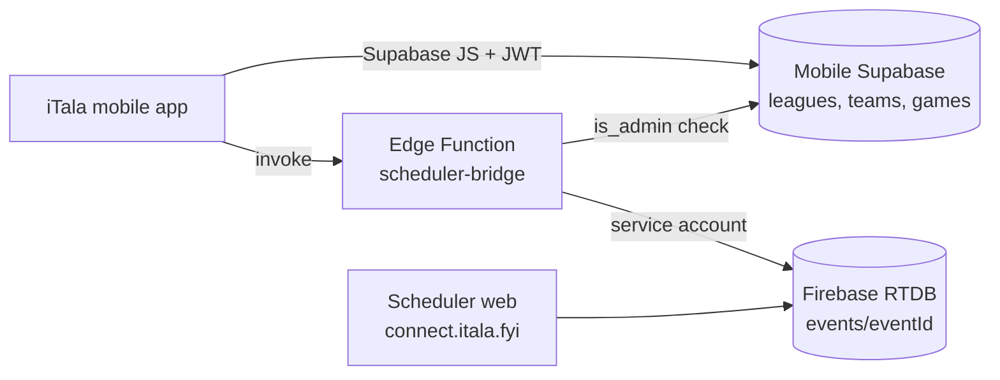
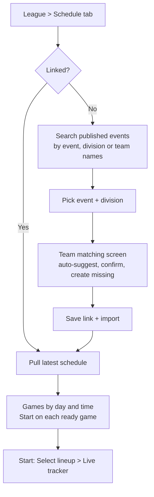
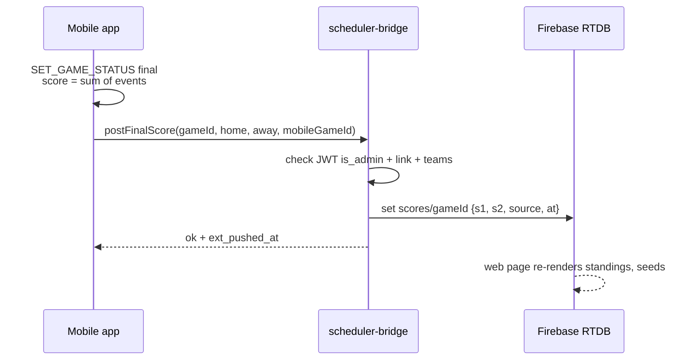

# iTala Mobile + Scheduler Integration Plan

25/09/2026 · Aeron

## Summary

Both phases are feasible, but the Scheduler needs a small hardening pass (Phase 0) first: its games have no stable ID and its database appears to accept writes from anyone. Once that is done, a thin bridge between the two databases lets the mobile app pull a division's schedule and push final scores back.

**What we want**

- **Phase 1:** a league in the iTala mobile app pairs with one event + division in the Scheduler (connect.itala.fyi), imports its teams (and optionally rosters), and lists its scheduled games by day and time, each with a Start button.
- **Phase 2:** when the scorekeeper finalises a game in the mobile app, the final score is written to the Scheduler, which then drives standings, seeding and the TBD playoff slots.

**Recommended approach in brief**

1. **Phase 0 (Scheduler):** give every scheduled game a permanent `gameId`, key scores by that ID instead of by list position, and lock down the Firebase database and admin login.
2. **Bridge:** a Supabase Edge Function in the mobile app's own Supabase project reads from and writes to the Scheduler's Firebase database. The mobile app never holds Firebase credentials.
3. **Mobile:** add link columns to `leagues`, `teams` and `games`, a new Schedule tab with pairing and team matching, and a Start action that turns an imported `scheduled` game into a `live` one.
4. **Playoffs:** Phase 1 skips games whose teams are still TBD, as suggested. Because the Scheduler resolves TBD slots with about 60 lines of deterministic code, the bridge can resolve them too, so playoff games can appear automatically once their teams are known. That is optional, not required.

**Basis of this analysis.** I couldn't reach your computer during this session, so I didn't read the local `iTala` or `iTala-platform` folders. The mobile app analysis uses the code snapshot saved in this project (schema, sync layer, types and the 19/08/2026 APP\_CONTEXT survey). The Scheduler analysis uses the live source served at connect.itala.fyi (`db.js`, `scheduler.js`, `app.js`, `auth.js`, `config.js`). If either local folder is newer than those, re-check the details marked as findings.

## Current state: iTala mobile app

The mobile app is a React Native / Expo client that works offline first and mirrors every change to its own Supabase Postgres project. It already has a `scheduled` game status that nothing ever writes.

**Architecture**

- The local reducer (`StoreProvider.tsx`) is the source of truth, saved to AsyncStorage. When Supabase is configured, `sync.ts` pushes each action to a table row and refetches every table when any Realtime change arrives.
- Conflicts are last write wins. There is no outbox, so a push that fails while offline is not retried (it only reconverges when a later push or pull happens).
- There is one tenant: every signed-in user can read every league. Writes need `profiles.is_admin`, which is granted by the bcrypt-checked `elevate_to_admin` password RPC.
- IDs are short base36 strings generated on the device and stored as `text` primary keys.

**Data model (Supabase `public` schema)**

| Table | Key columns | Notes for this integration |
| --- | --- | --- |
| `leagues` | `id`, `name`, `season`, `kind` (league or recreational), `foul_out_limit`, `created_at` | This is where a link to a Scheduler event + division would go. |
| `teams` | `id`, `league_id`, `name`, `color`, `logo`, `team_only`, `player_ids[]` | Scoped to a league. There is no link to the Scheduler's team code. |
| `players` | `id`, `league_id`, `name`, `number` | League player pool. The Scheduler also stores `{name, num}` per team, so rosters could be imported. |
| `games` | `id`, `league_id`, `home_team_id`, `away_team_id`, `status` (scheduled, live, final), `scheduled_at` (epoch ms), `location`, `finished_at`, `home_on_court[]`, `away_on_court[]`, `period` | There is no FK from games to teams (H-2). `scheduled_at` is currently always the creation time. |
| `events` | `id`, `game_id`, `team_id`, `player_id`, `type`, `period`, `ts`, `note` | An append-only stat log. Scores are **derived** from these events and never stored. |
| `app_settings`, `profiles`, `admin_*` |  | Settings, roles and admin auth. |

**Behaviour that matters here**

- `CREATE_GAME` always creates a game as `live` with `scheduledAt = Date.now()`. There is no "create for later" path, and no action that moves a game from `scheduled` to `live`.
- In `GamesOnDateScreen`, tapping a `scheduled` game opens the box score, not the tracker. The screen groups games by the device's local `YYYY-MM-DD` date, and no timezone is stored anywhere.
- A game becomes final through `SET_GAME_STATUS`, which sets `finishedAt`. After that the tracker can't be reopened (H-5), so corrections after finishing aren't possible today.
- In mobile standings a tie counts as a home win (H-4). The Scheduler counts a tie as neither a win nor a loss.
- Home and away are chosen by tap order in `NewGameScreen` and have no meaning beyond that.

## Current state: Scheduler app (connect.itala.fyi)

The Scheduler is a static vanilla-JS site on Netlify. It stores each event as a single JSON document in **Firebase Realtime Database** (project `bpblitalaplatform`). It is a separate system from the mobile app's Supabase project: its Supabase project (`gywxqgfbwcvycsypakmk`) is used only for image storage.

**Architecture**

- `db.js` wraps Firebase RTDB (`get`, `set`, `update`, `push`, `listen`), with a localStorage fallback. There is no server code.
- `auth.js` logs users in by comparing a password against `AUTH_CREDENTIALS` in `config.js`, which is **served publicly to every browser**. The Firebase SDK is never signed in. The code itself says to "replace with Firebase Auth later".
- Because no Firebase identity exists, both public viewers and admins hit the database unauthenticated. So the RTDB rules must currently allow **unauthenticated reads and writes** on `events`. (This is inferred from the code. I didn't probe the live database.)
- `scheduler.js` does circle-method round robin with a 120-minute rest gap per team, packs games into 60-minute slots × courts, and generates seeded single-elimination brackets.

**Data model (Firebase RTDB paths)**

```
platform/                     global config, sponsors, rule template
events/{eventId}              Firebase push key
  name, status (draft|published), createdBy (admin|superadmin)
  scheduleDays ["YYYY-MM-DD", ...], timeStart "09:00", timeEnd "20:00", courts
  logo, theme, sponsors, rulesHtml
  divisions/{divId}           "div_<timestamp>"
    name, color, bracketCount, playoff, seedBracket, customGamesPerTeam, gamesPerTeam
    teams/{teamCode}          "t_<timestamp>_<rand>"
      name, coach, players [{name, num}]
  schedule [ ... ]            ARRAY, position = identity
    day "YYYY-MM-DD" | "", time "h:mm AM" | "", court
    divId, bracketId (group A/B), team1, team2 (team codes or "TBD")
    label, type (group|semi|final), s1, s2
    playoff, bracketGameId "po_<divId>_<n>", team1Source, team2Source, playoffRound
  scores/{scheduleIndex}      {s1, s2}   live score entry, keyed by array index
```

**Findings that shape the integration**

1. **Games have no stable ID.** A game is identified by its position in `schedule[]`, and `scores` is keyed by that position. Adding a round robin re-sorts the array, deleting a game splices it, and re-publishing regenerates it. Each of these shifts positions without moving `scores`, so scores can land on the wrong game. This is a latent bug today, and an external system can't safely refer to a game until it's fixed. Only playoff games carry an ID (`bracketGameId`).
2. **Scores live in two places.** `schedule[i].s1/s2` is written on save, while `scores/{i}` is written by the public page's score inputs and overlaid when the page renders. `editorSave` writes the whole event, including a possibly stale `scores` object, so it can overwrite live score entries.
3. **Playoff teams are never stored.** A playoff game is saved as `TBD vs TBD` with `team1Source` (a seed rank or the winner of a `bracketGameId`). The real teams are resolved in the browser each render by `resolveAllPlayoffs`. Seeds resolve only after every group game in the division has a score. Tie-breaks are wins, then points difference, then points for (there's no head-to-head).
4. **Time is local text with no timezone.** Each game has a `day` string plus a `time` string like `"2:00 PM"`. Unscheduled games have empty strings and sit in an "Unscheduled" row.
5. **There's no venue field.** Location is only the `court` number.
6. **One event can have many divisions.** Each division has its own teams, standings and bracket. Teams are keyed per division, so the same club in two divisions has two team codes.

## Data model mapping

The natural pairing is **one mobile league to one Scheduler division** (within one event). The event is a container of divisions that don't play each other. The three gaps to close are a stable game ID, a timezone, and team-side orientation.

| Mobile (Supabase) | Scheduler (Firebase RTDB) | Mapping rule | Gap or risk |
| --- | --- | --- | --- |
| `leagues.id` | `events/{eventId}` + `divisions/{divId}` | New columns `ext_event_id`, `ext_division_id` on `leagues` | One league = one division. Pairing a league to a whole event mixes divisions. |
| `leagues.name` / `season` | `event.name` / `division.name`, `scheduleDays` | Used only for search and suggestions when pairing | Names are free text, so matching is fuzzy. |
| `teams.id` | `divisions/{divId}/teams/{teamCode}` | New column `teams.ext_team_code` | Codes are per division. Renaming a team in the Scheduler must not break the link. |
| `teams.name` | `team.name` | Normalised match (case, spaces, punctuation), then the user confirms | Likely near-misses such as "Warriors" and "Warriors BC". |
| `teams.color`, `logo` | `division.color` (division-level only) | Keep mobile values and assign a colour on import | The Scheduler has no team colour or logo. |
| `players` (`name`, `number`) | `team.players[]` (`name`, `num`) | Optional roster import, matched on jersey number then name | Players are an array with no IDs. Duplicates or blank numbers are possible. |
| `games.id` | `schedule[i]` (no ID today) | New column `games.ext_game_id` = Scheduler `gameId` (added in Phase 0) | **Blocker** until Phase 0 lands. Array positions shift. |
| `games.home_team_id` / `away_team_id` | `team1` / `team2` | Convention: **team1 = home, team2 = away**, saved with the link | Getting this wrong swaps the score in Phase 2. |
| `games.scheduled_at` (epoch ms) | `day` + `time` (local text) | Convert using an event timezone (new field, or a per-league setting in mobile) | There's no timezone today. Devices in other zones would group games under the wrong day. |
| `games.location` | `court` | `"Court " + court` (plus a venue if one is added later) | There's no venue field. |
| `games.status` | Derived: `s1`/`s2` present = final | Import as `scheduled`. Mobile controls the move to `live` and `final`. | The Scheduler has no "live" state. |
| Final score (derived from `events`) | `scores/{gameId}` = `{s1, s2}` | Phase 2 push, oriented by the home/away rule above | Mobile scores are computed, so the push must re-derive them and send totals only. |
| Tie handling (home wins) | A tie is no result | Block finalising a tied game in mobile, or require OT | The two systems would disagree on standings. |
| `label`, `type`, `playoff`, `bracketGameId` | No equivalent | Store as `ext_label`, `ext_type` for display ("Group A", "Semi 1") | Nice to have. |

## Architecture options

The recommendation is **Option B, a bridge Edge Function**. It keeps Firebase access and the mapping logic in one server-side place, reuses the mobile app's existing admin check for Phase 2 writes, and survives a later move of the Scheduler to Postgres.

| Option | How it works | Pros | Cons | Effort |
| --- | --- | --- | --- | --- |
| A. Mobile reads Firebase directly | Add the Firebase JS SDK (or plain REST `fetch` of `.json` paths) to the Expo app | Fastest to build. Realtime is possible. | Firebase config and write access ship in the app binary. Mapping logic is duplicated in the client. Phase 2 writes can't be secured without Firebase Auth in the app. | Low |
| **B. Bridge Edge Function (recommended)** | A Supabase Edge Function in the mobile project holds a Firebase service account. It exposes `listEvents`, `getDivisionSchedule` and `postFinalScore`. | No Firebase credentials on phones. Writes are gated by the existing `is_admin`. One place for normalising, TBD resolution and audit. The mobile app only talks to Supabase. | One more deployable. Cold starts. Realtime needs polling or a webhook. | Medium |
| C. Nightly or on-demand sync job | A job copies Scheduler data into new mobile tables (`ext_schedule`), and the mobile app reads them through the normal sync | Mobile code stays almost unchanged, and Realtime works for free | Data goes stale between runs. Phase 2 still needs a write path. Two copies to reconcile. | Medium |
| D. Move the Scheduler onto the same Supabase Postgres | Rewrite `db.js` against Supabase tables with real IDs, FKs and RLS | One database. Stable IDs, real auth, joins. Removes the problem for good. | Largest change. Needs data migration and a Scheduler regression test. | High |



The mobile app calls the bridge to browse and pull, then writes the imported rows through its normal sync path. Phase 2 finals go back through the same bridge.

If you'd rather prove Phase 1 in a few days, Option A in **read-only** form (a REST `GET` of one event) works as a spike. It shouldn't be used for Phase 2 writes.

## Phase 1 design: pair, pull, start

Phase 1 adds a **Schedule** tab to League Detail. An admin pairs the league with a published event + division, confirms team matches, and then sees the division's games grouped by day with a Start button on each.

**Phase 0 prerequisites (Scheduler side)**

1. Add `gameId` to every schedule entry: `"g_" + push key` for new games, backfilled once for existing ones. It must survive sorting, drag-and-drop, delete and "+ Round Robin".
2. Re-key `scores` from array index to `gameId`, with a one-off migration. Change `applyScoresToSchedule` and `pubScoreChange` to match.
3. Stop `editorSave` and `editorAutoSave` from writing the `scores` node (score entry owns it).
4. Stop re-publishing from regenerating the schedule once any game has a score, or have it keep `gameId`s.
5. Add `timezone` to the event (for example `Asia/Manila` or `Pacific/Auckland`), defaulting to the organiser's zone.
6. Replace the password-in-`config.js` login with Firebase Auth, and tighten RTDB rules to public read of published events and authenticated write (see Security).

**Mobile schema additions (idempotent SQL, same style as `schema.sql`)**

```sql
alter table public.leagues add column if not exists ext_source text;        -- 'itala-scheduler'
alter table public.leagues add column if not exists ext_event_id text;
alter table public.leagues add column if not exists ext_division_id text;
alter table public.leagues add column if not exists ext_timezone text;
alter table public.leagues add column if not exists ext_last_pulled_at timestamptz;
alter table public.teams   add column if not exists ext_team_code text;
alter table public.games   add column if not exists ext_game_id text;
alter table public.games   add column if not exists ext_label text;          -- 'Group A', 'Semi 1'
alter table public.games   add column if not exists ext_sync_state text;     -- ok | moved | removed | conflict
alter table public.games   add column if not exists ext_pushed_at timestamptz; -- Phase 2
create unique index if not exists games_ext_uidx on public.games (league_id, ext_game_id) where ext_game_id is not null;
create unique index if not exists teams_ext_uidx on public.teams (league_id, ext_team_code) where ext_team_code is not null;
```

The `League`, `Team` and `Game` types, the row mappers in `sync.ts`, and `gameToRow` all gain these fields.

**User flow**



- **Pairing suggestions** score each division by how many of its team names match the league's teams, plus name similarity between the league and the event or division. The top 3 are shown and the admin always confirms.
- **Team matching** lists each Scheduler team with its best mobile match. The admin can accept, pick another team, or "create new" (optionally importing the roster). Unmatched mobile teams are left alone.
- **Pull** (`getDivisionSchedule`) returns normalised games: `{gameId, day, time, startsAt, court, team1Code, team2Code, label, type, playoff, s1, s2}`. It runs on opening the tab, on pull-to-refresh, and when the app comes to the foreground.
- **Upsert rules** for each `ext_game_id`:
  - A new game with both teams known becomes a `scheduled` game, with `scheduled_at` set from `day` + `time` + timezone and `location` set to "Court N".
  - An existing `scheduled` game gets its time, court and teams updated. It's flagged `moved` if its time changed.
  - Games that are `live` or `final` locally are **never overwritten** by a pull.
  - A game that no longer exists in the Scheduler is flagged `removed` (not deleted), so the admin can decide.
  - Unscheduled games (empty day or time) are listed under "Time TBC", and TBD-team games are hidden (see Playoffs).
- **Start** adds a new reducer action `START_SCHEDULED_GAME` (`scheduled` to `live`, with lineup) that is pushed like `SET_GAME_STATUS`. `GamesOnDateScreen` routes admin taps on `scheduled` games to Select Lineup instead of the box score. Non-admins still see the pill.
- **Grouping** uses `ext_timezone` for day keys on linked leagues, so every device shows the same day. Unlinked leagues keep today's behaviour.
- Games created by hand in a linked league stay allowed and are marked "not in Scheduler".

## Phase 2 design: push final scores

When a linked game is finalised, the mobile app sends the derived final score to the bridge. The bridge writes `scores/{gameId}` in the Scheduler. From there the Scheduler's existing standings and `resolveAllPlayoffs` logic fill the TBD slots with no further change.



- **Payload** is `{ext_event_id, ext_game_id, home_pts, away_pts, mobile_game_id, finished_at}`. The bridge maps home and away to `s1` and `s2` using the saved team1 = home rule, and checks that both team codes still match the game in the Scheduler.
- **Idempotent**: re-sending the same score is a no-op. `s1`/`s2` are written alongside `source: "itala-mobile"`, `mobileGameId` and `updatedAt`, so the web page can show a "recorded in iTala" badge.
- **Retries**: the app has no outbox today, so add a small persistent queue of "finals to push" in AsyncStorage. It's retried on app start, when the device comes back online, and when the Schedule tab opens. Until it succeeds the game shows "Score not yet sent". This is the first outbox in the app, so it should be built generically.
- **Ties**: block finalising a linked game when the score is level ("Play overtime or adjust"). Otherwise the Scheduler records no winner and the bracket stalls on TBD.
- **Corrections**: a final can't be reopened in mobile (H-5). Phase 2 either adds "Reopen game" for admins, which re-pushes on the next finalise, or accepts that score fixes are made by hand in the Scheduler. Decide which one wins if both change (see Open decisions).
- **Manual entry in the Scheduler stays possible**. If a score already exists with a different `source`, the bridge refuses and returns `conflict`, and the app shows both values rather than silently overwriting.
- **Optional extras**: push the box-score link or top scorer as `scores/{gameId}/meta`, and mark a game "live" in the Scheduler when Start is pressed so the public page can show a live badge.

## Playoffs and TBD games

This is easier than it looks. The Scheduler resolves every TBD slot from data the bridge already reads, using about 60 lines of pure logic (`resolvePlayoffTeams` plus the standings sort). So the bridge can run that same logic and return playoff games once both teams are known.

| Option | What the mobile app sees | Effort | Trade-off |
| --- | --- | --- | --- |
| 1. Skip TBD (your fallback) | Only games whose stored `team1`/`team2` are real codes. Playoffs are entered by hand in both apps. | None | Playoff scores are keyed twice, and a playoff game created in mobile has no Scheduler link. |
| **2. Resolve in the bridge (suggested, Phase 1.5)** | A playoff game appears automatically once its seeds or previous winners are known. Until then it's hidden, or shown as "Semi 1, teams TBD". | About 1 to 2 days | Two copies of the resolver must stay identical. Share one module or add a test fixture. |
| 3. Scheduler persists resolved teams | Stored `team1`/`team2` are updated when resolution changes, so every consumer reads plain data | About 1 to 2 days, Scheduler side | Stored values can go stale if a group score is corrected later, so it must re-resolve on every score change. |

Whatever the option, a playoff game's `gameId` stays the same when its teams change. A mobile game imported for a semi therefore has to accept a team change while it is still `scheduled`, and lock it once `live`. With Phase 2 in place, a winner pushed from mobile feeds the next round automatically. Seeds only resolve after **every** group game in the division has a score, so one missing score blocks the whole bracket.

## Security, auth and access

The Scheduler's security needs fixing before any integration writes to it. Today anyone who views the page source can log in as superadmin, and the database likely accepts writes from anyone.

- **Critical: admin passwords are public.** `config.js` ships `AUTH_CREDENTIALS` (superadmin and admin passwords) in plain text to every visitor. Rotate them now, and move login to Firebase Auth with custom claims or an `admins/{uid}` node for roles.
- **High: open database rules (inferred).** The web app never authenticates to Firebase, so its admin writes only work if rules allow `.write: true`. Target rules:
  - public `.read` on published events only
  - `.write` only for `auth.token.role in (admin, superadmin)` or the bridge's service account
  - `scores/{gameId}` validated as integers 0 to 300
- **Bridge credentials**: the Firebase service account JSON is stored as a Supabase secret, never in the app or in git. The Edge Function checks the caller's Supabase JWT, then `public.is_admin()`, before any write. Reads can be open to any signed-in user.
- **Mobile admin model** stays as it is (one shared admin password, bcrypt, rate limited). Phase 2 adds "who pushed this score" to `admin_audit`.
- **Data exposure**: team rosters (names and jersey numbers) become readable through a second path. Both systems already publish them, so the change is small, but it's worth noting for school or junior events.

## Questions to answer

- [ ] Is the local `iTala-platform` folder the same code as what's live on connect.itala.fyi, and is there a `database.rules.json` or Firebase rules export?
- [ ] What are the current Firebase RTDB rules in the console, and does anything else (scripts, other apps) write to `events/`?
- [ ] Should one mobile league ever pair with **several** divisions (for example Men's and Women's in one league)? Or is it always one league to one division?
- [ ] Which timezone(s) do events run in? The data suggests the Philippines for BPBL, Sinagtala and HAP, but the org is NZ-based.
- [ ] Should the pull import **rosters** (players and jersey numbers) from the Scheduler, or only teams?
- [ ] Who records scores on game day: the mobile scorekeeper only, or also someone typing into the Scheduler web page?
- [ ] Can a basketball game here ever end tied (friendly or pool games with no OT)?
- [ ] Should the mobile app see **draft** events, or only published ones?
- [ ] Is it OK for Phase 0 to change how the Scheduler stores scores (a one-off migration of existing events)?
- [ ] Do past events need back-filling, or is this only for events from now on?
- [ ] Is a live badge on the public Scheduler page (game in progress in iTala) wanted?

## Risks

| Risk | Likelihood | Impact | Mitigation |
| --- | --- | --- | --- |
| Scores land on the wrong game because `scores` is keyed by array position | High (already latent) | High: wrong standings and seeds | Phase 0 `gameId` + re-keyed scores. This is a blocker. |
| Public admin passwords or open RTDB rules let anyone edit or wipe events | High | High | Rotate passwords, add Firebase Auth, tighten rules (Phase 0) |
| Home/away swapped against team1/team2, so a pushed score is reversed | Medium | High | Fix team1 = home at import, have the bridge re-check team codes, and show both team names on the confirm dialog |
| A scheduled game is edited in the Scheduler after it's live in mobile | Medium | Medium | Never overwrite `live`/`final` locally, and flag a `conflict` |
| Fuzzy team matching pairs the wrong teams | Medium | Medium | The admin confirms every match, codes are stored, and matching never runs silently |
| Final push fails offline and is forgotten (no outbox) | Medium | Medium | A persistent push queue and a visible "not sent" state |
| Timezone mismatch groups games under the wrong day | Medium | Low to medium | An event timezone and timezone-aware day keys for linked leagues |
| Re-publishing an event regenerates the schedule and orphans links | Medium | High | Block regeneration once scores exist, or keep `gameId`s. The bridge flags `removed`. |
| `editorSave` overwrites live `scores` with a stale copy | Medium | Medium | Stop writing `scores` from the editor (Phase 0) |
| Tied final, which the systems treat differently | Low | Medium | Block tied finals on linked games |
| Two resolver implementations drift (playoff option 2) | Medium | Medium | Shared module or golden-file tests |
| Mobile full-refetch design (H-8) wipes imported rows on first pull | Low | Medium | Import writes through normal sync, so rows exist remotely. Test with local-only mode. |
| Firebase free-tier limits or Edge Function cold starts | Low | Low | Cache the event per pull and pull only on demand |

## Assumptions

- The live site at connect.itala.fyi matches the local `iTala-platform` code, and the project snapshot of the mobile app (19/08/2026) matches the local `iTala` code.
- The Scheduler is the **source of truth for fixtures** (who plays whom, when, where). The mobile app is the **source of truth for stats and final scores** of games it records.
- One mobile league maps to exactly one Scheduler division, and that division lives in one event.
- Scheduler `team1` is treated as home and `team2` as away.
- Only admins (mobile `is_admin`) can pair, import, start and push. Spectators only read.
- Games last about 60 minutes (the Scheduler's slot size), and one scorekeeper records each game.
- Both systems stay in their current stacks (Expo + Supabase, and static JS + Firebase) for this project, with no migration to one database yet.
- The Scheduler owner can deploy Phase 0 changes and a Firebase rules update before mobile work starts.

## Open decisions

| # | Decision | Options | Suggested |
| --- | --- | --- | --- |
| D1 | Integration architecture | A direct Firebase · B bridge Edge Function · C sync job · D merge DBs | B, with A read-only as a spike |
| D2 | Pairing granularity | League to division · league to event (all divisions) | League to division |
| D3 | Team handling on pair | Match existing only · match + create missing · always import fresh | Match + create missing |
| D4 | Roster import | None · on pair only · on every pull | On pair, with a manual "refresh roster" |
| D5 | Playoffs | Skip TBD · resolve in bridge · Scheduler persists resolved teams | Skip in Phase 1, resolve in bridge in Phase 1.5 |
| D6 | Who wins when scores differ | Mobile always · Scheduler always · flag a conflict for a human | Flag a conflict |
| D7 | Corrections after final | Add "Reopen game" in mobile · fix by hand in the Scheduler | Reopen game, re-push on finalise |
| D8 | Tied games | Block the tie · allow and push the tie | Block on linked games |
| D9 | Refresh model | Manual pull · pull on open and foreground · realtime via Firebase listener | Pull on open and foreground |
| D10 | Timezone source | Field on the Scheduler event · per-league setting in mobile | Scheduler event field |
| D11 | Long term | Keep two DBs · move the Scheduler to Supabase later | Revisit after Phase 2 |

## Next steps and rough effort

Estimates assume one developer who already knows both codebases. They're working days, not calendar days.

| Step | Scope | Effort |
| --- | --- | --- |
| 0a. Security quick fix | Rotate the exposed passwords today and check the RTDB rules in the console | 0.5 day |
| 0b. Scheduler hardening | `gameId`, scores re-keyed + migration, editor stops writing `scores`, event timezone, Firebase Auth + rules | 3 to 5 days |
| 1a. Bridge function | `listEvents`, `getDivisionSchedule` (normalised, TBD-filtered), auth checks, secrets | 2 to 3 days |
| 1b. Mobile schema + sync | `ext_*` columns, types, row mappers, `START_SCHEDULED_GAME` | 1 to 2 days |
| 1c. Mobile UI | Schedule tab, event search, team matching, day list with Start, sync-state badges | 4 to 6 days |
| 1.5 Playoff resolution | Port the resolver to the bridge with shared tests | 1 to 2 days |
| 2a. Final push | `postFinalScore`, the outbox queue, the tie guard, conflict handling | 3 to 4 days |
| 2b. Corrections | "Reopen game" for admins, and re-push | 1 to 2 days |
| Testing | End-to-end on a copy of a real event (for example HAP), including a two-device scenario | 2 to 3 days |

Suggested order: 0a now, then settle D1 to D10 in one short session, then 0b, 1a to 1c and a pilot on one event, then 2a and 2b, then 1.5.
